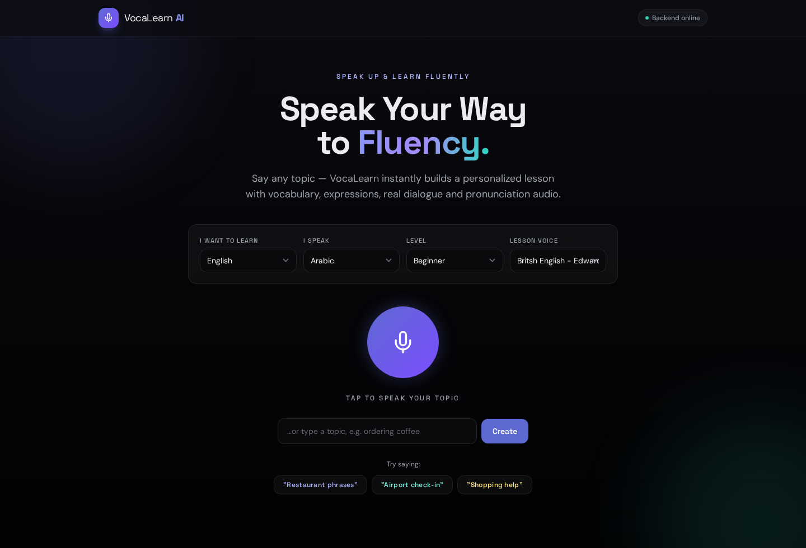
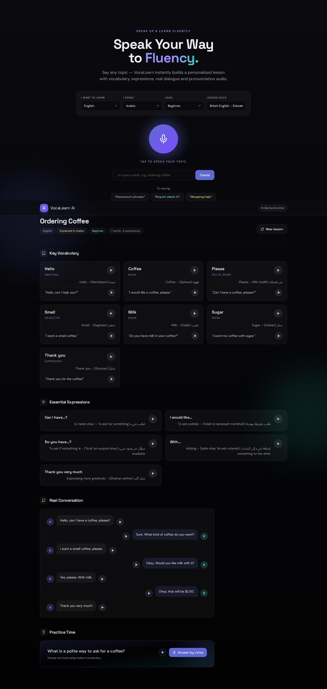
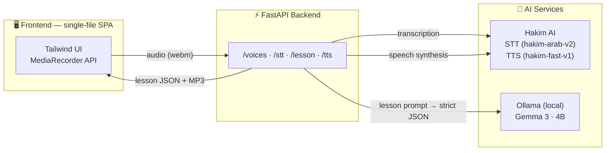

<div align="center">

# 🎙️ VocaLearn AI

### Speak Your Way to Fluency

**An AI-powered language tutor that turns any spoken topic into a complete, personalized lesson — with vocabulary, expressions, real dialogue and native-quality pronunciation audio.**




</div>

---

## ✨ What it does

Traditional language apps teach generic lessons. **VocaLearn flips that:** you *speak* the topic you actually care about — *"ordering coffee"*, *"airport check-in"*, *"job interview"* — and the AI builds a focused lesson around it in seconds, applying the **Pareto principle**: the 20% of vocabulary that powers 80% of real conversations.

```
 🎤 You speak a topic  →  📝 STT transcribes it  →  🧠 Local LLM builds the lesson  →  🔊 TTS speaks every word
```

| Setting | What it controls |
|---|---|
| 🌍 **I want to learn** | Target language of the lesson (English, Arabic, French, Spanish, German) |
| 🗣️ **I speak** | Your native language — all meanings & usage notes are explained in it |
| 📈 **Level** | Beginner / Intermediate / Advanced — adapts vocabulary and sentence complexity |
| 🎧 **Lesson voice** | The TTS voice used for pronunciation (auto-matched to the target language) |
| 💬 **Topic** | Spoken through the mic or typed — anything you want to talk about |

## 🎓 Every lesson includes

- **7 key vocabulary words** — with part of speech, meaning *in your native language*, and a natural example sentence
- **5 essential expressions** — the phrases natives actually use, with usage notes
- **A realistic dialogue** (4–6 exchanges) — rendered as a chat conversation, reusing the lesson vocabulary
- **A practice question** — answer it *by voice*; your answer is transcribed back to you
- **🔊 One-tap pronunciation** on every word, example, expression and dialogue line

<div align="center">

</div>

## 🏗️ Architecture



**Privacy by design:** lesson generation runs on a *local* LLM via Ollama — your learning content never leaves your machine. Only voice transcription and speech synthesis use the Hakim AI API.

## 🛠️ Tech stack

| Layer | Technology |
|---|---|
| Backend | **FastAPI** + Uvicorn, Pydantic validation, CORS |
| LLM | **Gemma 3 (4B)** served locally by **Ollama**, prompt-engineered for strict JSON output |
| Speech-to-Text | **Hakim AI** `hakim-arab-v2` (Arabic + English) |
| Text-to-Speech | **Hakim AI** `hakim-fast-v1`, 4 voices (Arabic 🇸🇦 / English 🇬🇧🇺🇸) |
| Frontend | Vanilla JS single-page app, **Tailwind CSS**, Space Grotesk + DM Sans, Lucide SVG icons |
| UX | Glassmorphism dark theme, skeleton loading, audio caching, RTL support, `prefers-reduced-motion`, WCAG-conscious contrast |

## 🚀 Quick start

### Option A — Docker (recommended)

The whole stack (FastAPI app + Ollama LLM) runs with one command:

```bash
git clone https://github.com/LouayKliai/VocaLearn_AI
cd VocaLearn/AI_Assisstant

# Add your Hakim AI key
cp .env.example .env       # then edit .env

docker-compose up -d
```

Open **http://localhost:8000/app** — that's it.
On first start the `ollama` service automatically downloads the Gemma 3 model (~3.3 GB, one time only); it's cached in a Docker volume afterwards.

```
┌──────────────────┐      ┌────────────────────┐
│  vocalearn-api   │ ───▶ │  vocalearn-ollama  │
│  FastAPI :8000   │      │  Gemma 3 · 4B      │
└──────────────────┘      └────────────────────┘
        │
        ▼
   Hakim AI API (STT + TTS)
```

### Option B — Manual setup

#### Prerequisites

- Python **3.10+**
- [Ollama](https://ollama.com) running locally with the model pulled: `ollama pull gemma3:4b`
- A [Hakim AI](https://tryhakim.ai) API key (for STT + TTS)

#### Run it

```bash
# 1. Create the environment
python3 -m venv .venv
.venv/bin/pip install -r Backend/requirements.txt

# 2. Set your API key
export HAKIM_API_KEY="your_key_here"

# 3. Launch
cd Backend
../.venv/bin/uvicorn v1:app --reload
```

Then open **http://localhost:8000/app** — allow microphone access, pick your languages, and start speaking. 🎤

> **Note:** the first lesson takes longer (~1–3 min) while Ollama cold-loads the model; subsequent lessons are faster.

## 📡 API reference

| Method | Endpoint | Description |
|---|---|---|
| `GET` | `/app` | Serves the web app |
| `GET` | `/voices` | Lists available TTS voices |
| `POST` | `/stt` | Multipart audio upload → `{ "text": "..." }` |
| `POST` | `/lesson` | `{ topic, language, native_language, level }` → structured lesson JSON |
| `POST` | `/tts` | `{ text, voice }` → MP3 audio stream |

<details>
<summary><b>Example lesson response</b></summary>

```json
{
  "topic": "Ordering Coffee",
  "language": "english",
  "native_language": "arabic",
  "level": "beginner",
  "words": [
    {
      "word": "coffee",
      "part_of_speech": "noun",
      "meaning": "قهوة - مشروب من حبوب محمصة",
      "example": "I want a cup of coffee."
    }
  ],
  "expressions": [
    { "expression": "Can I have…?", "usage": "لطلب شيء بأدب" }
  ],
  "dialogue": [
    { "speaker": "A", "text": "Hello! I want coffee, please." },
    { "speaker": "B", "text": "What size would you like?" }
  ],
  "question": "What is a polite way to ask for a coffee?"
}
```
</details>

## 📁 Project structure

```
AI_Assisstant/
├── Backend/
│   ├── v1.py              # FastAPI app — STT, TTS, LLM lesson engine
│   ├── requirements.txt
│   └── audio/             # Generated speech files
├── Frontend/
│   └── index.html         # Single-file SPA (UI + logic, zero build step)
├── Dockerfile             # API image (python:3.12-slim)
├── docker-compose.yml     # api + ollama services, model auto-pull
├── .env.example
└── screenshots/
```

## ⚙️ Configuration

| Variable | Default | Description |
|---|---|---|
| `HAKIM_API_KEY` | — | Hakim AI key for STT/TTS (required) |
| `OLLAMA_URL` | `http://localhost:11434` | Ollama server address (set automatically in Docker) |
| `OLLAMA_MODEL` | `gemma3:4b` | Any Ollama model — swap in a larger one for richer lessons |

## 🗺️ Roadmap

- [ ] Pronunciation scoring — compare the learner's recording to the target audio
- [ ] Lesson history and spaced-repetition review
- [ ] Streaming lesson generation for instant first paint
- [ ] More languages and voices
- [ ] User accounts and progress tracking

## 👤 Author

**Louay Kliai**
📧 [kliailouay@gmail.com](mailto:kliailouay@gmail.com)

*Built as part of an AI engineering course project — combining STT, local LLMs and TTS into a complete voice-first product.*

---

<div align="center">
<sub>⭐ If you find this project interesting, a star is always appreciated!</sub>
</div>
